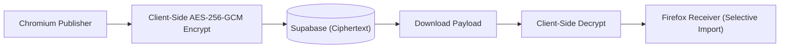
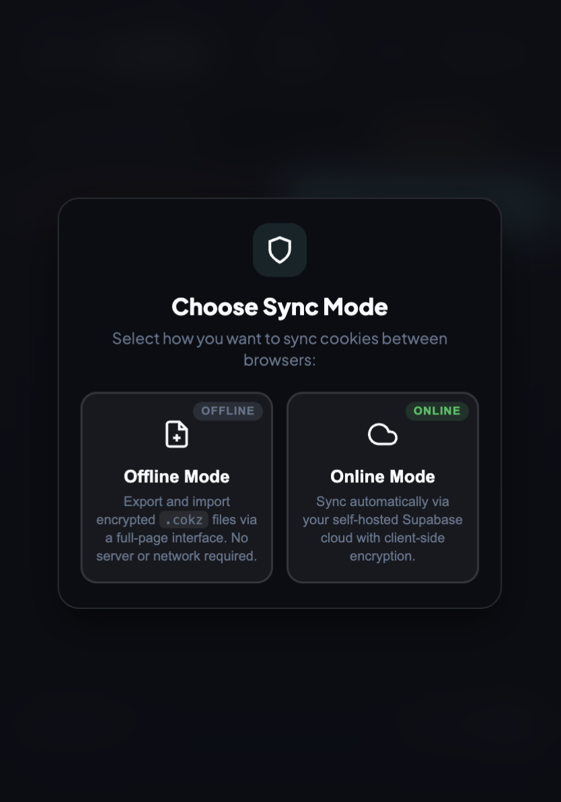
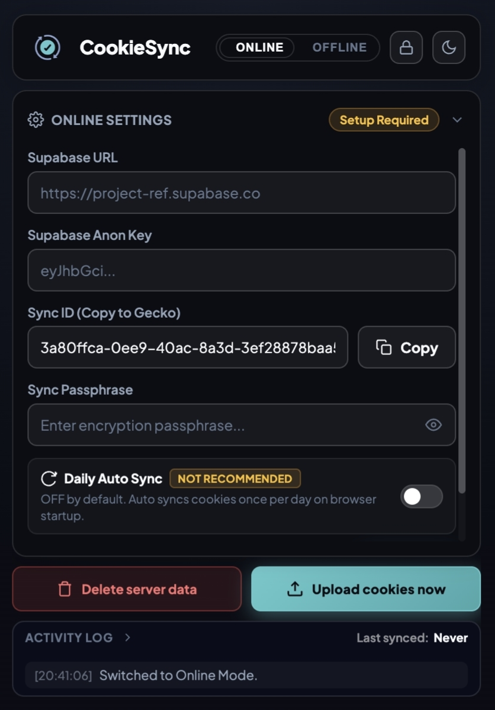
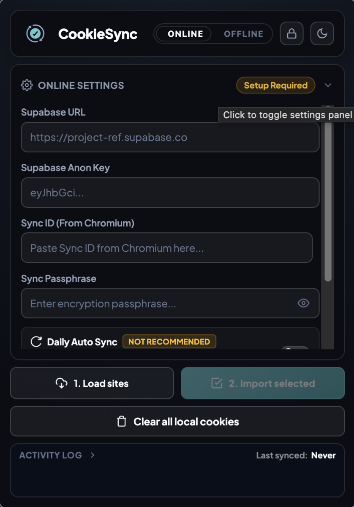
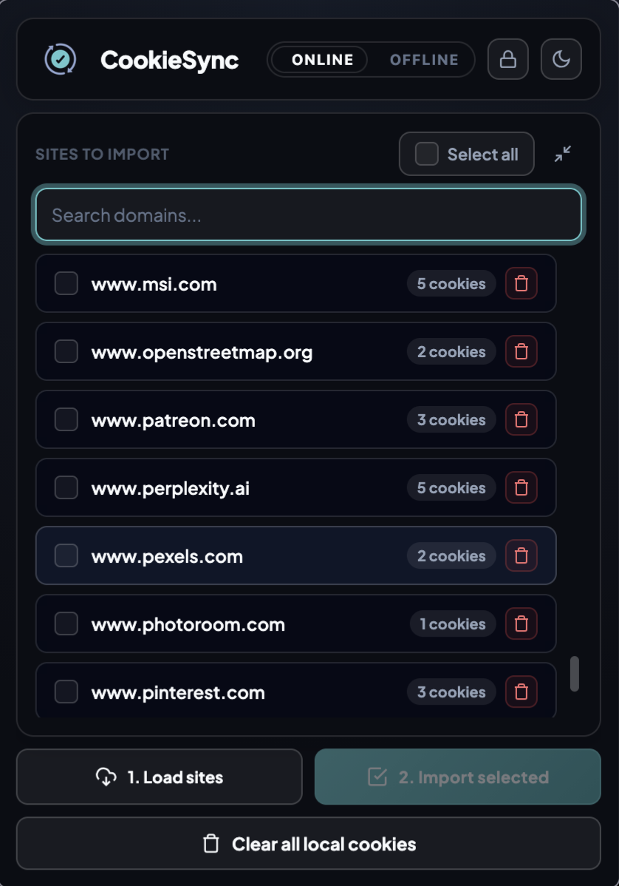
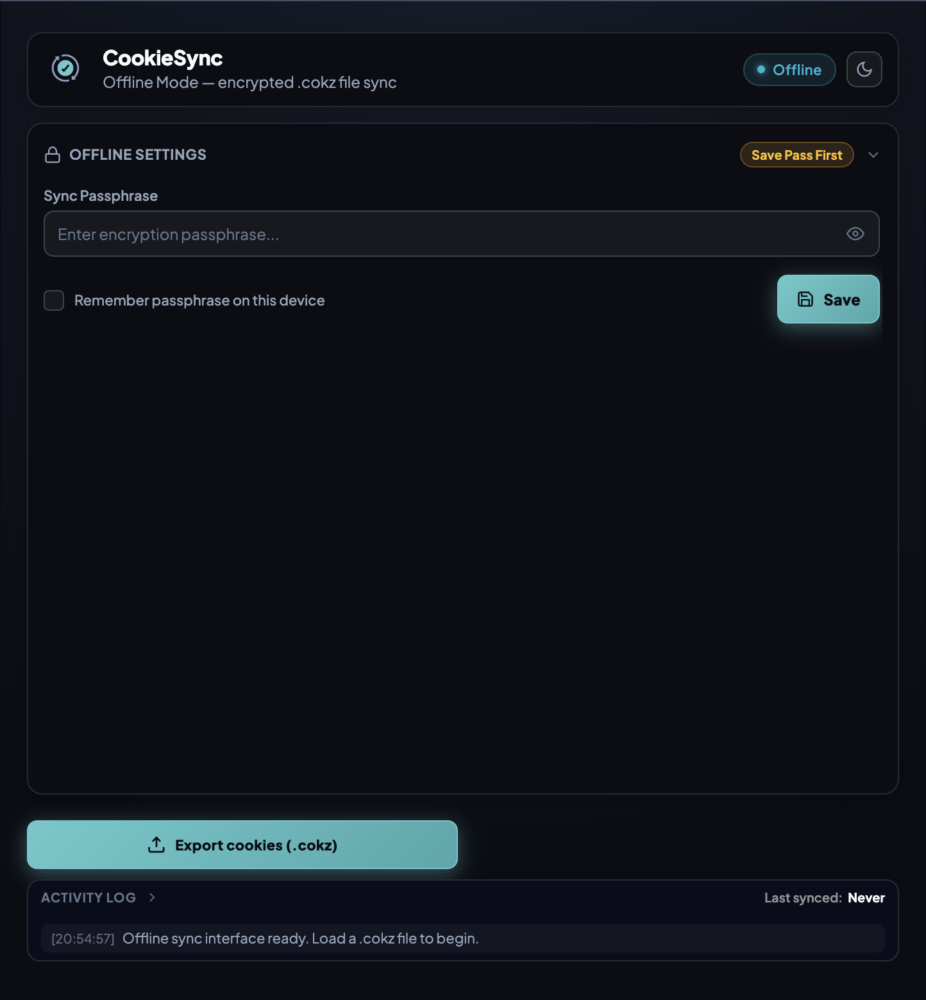
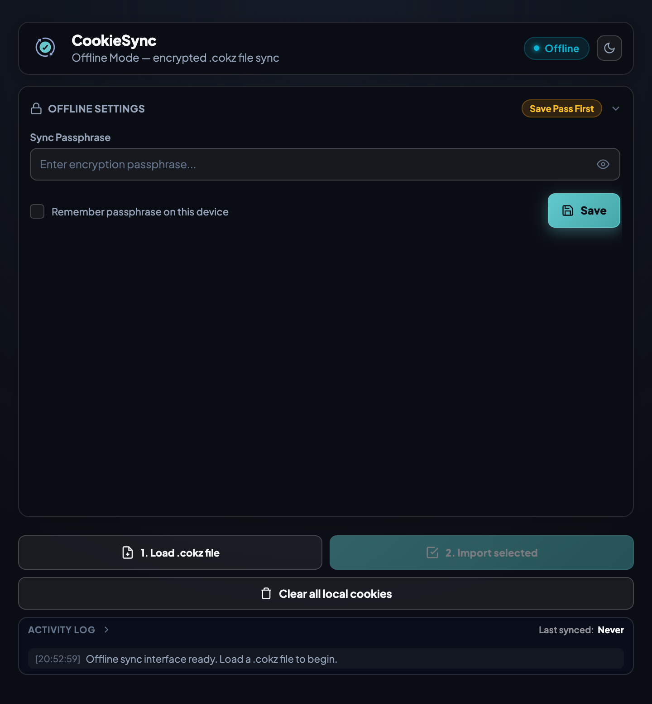

# CookieSync


[](./LICENSE)
[](https://github.com/naitiktuxx/CookieSync/releases/latest)
[](https://github.com/naitiktuxx/CookieSync/releases)

CookieSync is a lightweight open-source tool for transferring active web sessions securely across different browser engines. By encrypting cookie snapshots client-side before transmission, CookieSync lets you move authenticated site sessions using your own self-hosted Supabase database or air-gapped local files—without exposing unencrypted credentials to servers or local disk storage.

---

## Contents

- [What is CookieSync?](#what-is-cookiesync)
- [Why CookieSync?](#why-cookiesync)
- [Key Features](#key-features)
- [Quick Start](#quick-start)
- [Architecture & Data Flow](#architecture--data-flow)
- [Interface Tour](#interface-tour)
- [What Makes It Different?](#what-makes-it-different)
- [Installation](#installation)
- [Usage & Operational Nuances](#usage--operational-nuances)
- [Security Summary](#security-summary)
- [Privacy Summary](#privacy-summary)
- [Supabase Backend Setup](#supabase-backend-setup)
- [Troubleshooting](#troubleshooting)
- [Documentation](#documentation)
- [License](#license)

---

## What is CookieSync?

CookieSync is built as a pair of browser extensions generated from a single TypeScript codebase:

- **Chromium Publisher**: Built for Chrome, Brave, Edge, Arc, Opera, and Vivaldi (Manifest V3). It captures your browser's cookie state, encrypts it client-side, and uploads the snapshot to a Supabase table under your control or exports it to an encrypted `.cokz` file.
- **Firefox Receiver**: Built for Firefox, LibreWolf, Zen Browser, and Waterfox (Manifest V2). It retrieves the encrypted payload, decrypts it locally, and presents an interactive domain picker allowing you to select exactly which sites' cookies to write into your target browser profile.

Rather than relying on proprietary cloud sync infrastructure or third-party accounts, CookieSync provides direct control over your session transport using your own database or air-gapped local files.

---

## Why CookieSync?

Carrying an active logged-in web session from one browser to another traditionally presents an annoying dilemma: you either export plaintext cookie files, email or message them to yourself, or repeatedly enter credentials and multi-factor authentication tokens on every browser you use. 

Plaintext cookie exports sit unencrypted on local disks and cross networks in the open, exposing sensitive session tokens to anything that can read the file or inspect network traffic. 

CookieSync exists for the ordinary case of wanting to carry an authenticated session from one browser to another safely, without exposing unencrypted session keys to disk storage or central servers. 

The architecture is built around several explicit design choices:

- **Client-Side Encryption**: Data is encrypted using AES-256-GCM before it ever leaves the browser. Supabase stores ciphertext only, and `.cokz` files contain strictly encrypted data.
- **Self-Hosted Infrastructure**: You point the extension at your own Supabase project. There is no central server, no shared accounts, and no tracking—just a database URL, an `anon` key, a generated Sync ID, and a passphrase you choose.
- **Asymmetric Workflow**: Uploading is all-or-nothing, but importing is selective. The Chromium Publisher encrypts and uploads the browser's entire Cookie Ledger in one payload, while the Firefox Receiver lets you pick exactly which domains from that payload get written into your browser profile.
- **Network Independence**: In the Offline Workspace, export and import passphrase-encrypted `.cokz` files locally without sending data over any network.

---

## Key Features

### Security & Cryptography
- **AES-256-GCM Payload Encryption**: Encrypts cookie data client-side via the Web Crypto API using keys derived from your passphrase (PBKDF2-SHA-256, 250,000 iterations with random salts).
- **Isolated Authentication Headers**: Supabase authentication headers (`x-sync-auth`) are derived using a distinct fixed salt and 50,000 iterations, ensuring database headers cannot be used to decrypt payload data.

### Synchronization & Backend
- **Self-Hosted Supabase Integration**: Connects directly to a single `cookie_sync` PostgreSQL table protected by Row-Level Security (RLS) policies.
- **Selective Domain Import**: Inspect imported domains and pick specific sites before committing cookies to the browser profile.

### Offline Workflow
- **Air-Gapped `.cokz` File Transfer**: Export and import encrypted `.cokz` snapshot archives in the Offline Workspace without network connections.
- **Ephemeral Session Isolation**: Offline Workspace tabs immediately wipe loaded snapshots and domain lists from memory and storage upon tab closure or workspace reset.

### User Experience & Control
- **Dual Visual Themes**: Built-in single-click toggle between Deep Dark mode (default) and Catppuccin mode.
- **Optional Daily Auto-Sync**: Off by default. When enabled, executes one sync push or pull on browser startup per calendar day.
- **Unmasked Activity Logging**: In-popup log displaying underlying network responses and raw database status messages rather than generic errors.

---

## Quick Start

Setting up CookieSync takes about two minutes:

1. **Download Release**: Grab `CookieSync-Chromium-Host-v<version>.zip` and `CookieSync-Firefox-Receiver-v<version>.xpi` from [Latest Releases](https://github.com/naitiktuxx/CookieSync/releases/latest).
2. **Install Publisher**: Extract the Chromium ZIP and load it via `chrome://extensions` with **Developer Mode** enabled.
3. **Install Consumer**: Drag the `.xpi` file directly into Firefox (or load via `about:addons`).
4. **Configure Database**: Execute the SQL setup script from [SUPABASE_SCHEMA.md](./SUPABASE_SCHEMA.md) in your Supabase SQL Editor.
5. **Sync Sessions**: Enter your Supabase URL, `anon` key, and passphrase in Chromium Publisher to upload, then paste the generated Sync ID and passphrase in Firefox Receiver to load and selectively write site cookies.

---

## Architecture & Data Flow

CookieSync maintains end-to-end security boundaries by coordinating encryption and transport steps across browser engines as shown below:



### Build & Target Separation

The codebase compiles into two distinct extension bundles via `scripts/build.mjs`, which bakes a build-time constant `__BROWSER_TARGET__` (`"chromium"` or `"gecko"`) into each bundle. 

Which role an installed copy plays (publisher or consumer) is fixed by which bundle you installed, eliminating runtime role confusion.

### The Local Cookie Ledger

The background script runs in both builds. It listens for every cookie change event reported by the browser across all sites and records it into an unencrypted local Cookie Ledger (`chrome.storage.local`). 

This Cookie Ledger keeps the latest known state of each cookie, allowing the Chromium Publisher to build an instant snapshot on upload and the Firefox Receiver to detect deleted cookies accurately upon import.

### Row-Level Security

On the Supabase side, a single table (`cookie_sync`) stores one row per Sync ID: an encrypted JSON payload, an authentication hash, and an updated timestamp. 

Row-Level Security policies check that a request's `x-sync-auth` HTTP header matches the stored `auth_hash` before allowing read, write, or delete operations.

For complete project structure and developer workflows, see [CONTRIBUTING.md](./CONTRIBUTING.md).

---

## Interface Tour

The screenshots below illustrate how CookieSync presents its operational controls across mode selection, cloud sync, and offline file transfer interfaces:

### Sync Mode Selection

| Sync Mode Modal |
|:---:|
|  |
| **Mode Selection Modal**<br>Choose between self-hosted Supabase cloud sync (Online Mode) and local encrypted file transfer (Offline Workspace). |

### Online Mode (Cloud Sync)

| Publisher Setup | Receiver Site Import | Domain Selector |
|:---:|:---:|:---:|
|  |  |  |
| **Chromium Publisher**<br>Enter Supabase credentials, passphrase, and trigger cookie snapshot uploads. | **Firefox Receiver**<br>Fetch remote payloads, inspect active domains, and clear local cookies. | **Selective Domain Picker**<br>Search and select specific domains to write into the browser profile. |

### Offline Workspace (Local File Transfer)

| Chromium Export | Firefox Import Workspace |
|:---:|:---:|
|  |  |
| **Chromium Offline Workspace**<br>Export passphrase-encrypted `.cokz` snapshot files locally without network access. | **Firefox Offline Workspace**<br>Load `.cokz` archives in a full-page workspace for selective local cookie restoration. |

---

## What Makes It Different?

Comparing CookieSync against traditional cookie export/import methods highlights several structural differences:

| Feature / Rationale | Traditional Cookie Export / Import | CookieSync |
|---|---|---|
| **Data Storage at Rest** | Plaintext JSON or Netscape formatted text files | AES-256-GCM encrypted payloads (`.cokz` archives or database ciphertext) |
| **Transport Security** | Sent unencrypted over email, chat, or external storage | Client-side encrypted before network transmission |
| **Import Granularity** | All-or-nothing overwrite of browser cookie files | Selective per-domain inspection and import |
| **Credential Handling** | Passphrases not supported; raw session tokens exposed | Derived PBKDF2 keys (250,000 iterations); raw keys never leave browser |
| **Infrastructure Requirement** | Relies on third-party file hosts or email providers | Self-hosted Supabase instance or zero-network Offline Workspace |
| **Session Teardown** | Export files persist on disk unless manually deleted | Automatic tab teardown in Offline Workspace; optional 24-hour SQL TTL |

---

## Installation

Prebuilt release binaries are available on the [Releases Page](https://github.com/naitiktuxx/CookieSync/releases/latest). Version changelogs and release notes are published with each release.

### Chromium Publisher

1. Download `CookieSync-Chromium-Host-v<version>.zip` from the latest release.
2. Extract the ZIP archive locally.
3. Open `chrome://extensions` (or `brave://extensions`, `edge://extensions`).
4. Enable **Developer Mode** using the toggle in the upper right.
5. Click **Load unpacked** and select the extracted build directory.

### Firefox Receiver

1. Download `CookieSync-Firefox-Receiver-v<version>.xpi` from the latest release.
2. Drag the `.xpi` file directly into Firefox (or open `about:addons`, click the gear icon, and select **Install Add-on From File...**).
3. Click **Add** when prompted to complete installation.

> [!NOTE]
> Unsigned `.xpi` files require Firefox Developer Edition, Nightly, or unbranded builds unless signed by Mozilla. For temporary installation in standard Firefox builds, navigate to `about:debugging#/runtime/this-firefox`, click **Load Temporary Add-on**, and select `manifest.json` from the unzipped Gecko build directory.

### Release Verification

Verify the authenticity of downloaded release assets using `SHA256SUMS.txt`:

```bash
sha256sum -c SHA256SUMS.txt --ignore-missing
```

To build CookieSync from source code, refer to [CONTRIBUTING.md](./CONTRIBUTING.md#building-and-testing).

---

## Usage & Operational Nuances

### Online Mode Setup

1. **Chromium Publisher Setup**:
   - Open the popup and expand **Settings & Credentials**.
   - Enter your Supabase URL and `anon` key.
   - Enter a strong, unique passphrase.
   - Click **Save** to generate a Sync ID automatically.
   - Copy the Sync ID and click **Upload cookies now**.

2. **Firefox Receiver Setup**:
   - Open the popup and expand **Settings & Credentials**.
   - Enter the identical Supabase URL, `anon` key, Sync ID, and passphrase.
   - Click **Save**, then click **Load sites**.
   - Select the domains you want to import and click **Import selected**.

### Offline Workspace Setup

1. Click the **Online / Offline** pill toggle in the popup header bar.
2. **Chromium Publisher**: Enter an encryption passphrase, save it, and click **Export cookies (.cokz)** to save an encrypted snapshot locally.
3. **Firefox Receiver**: Open the Offline Workspace tab, enter the matching passphrase, select the `.cokz` file, choose desired domains, and click **Import selected**.

> [!IMPORTANT]
> Closing the Offline Workspace tab immediately purges decrypted snapshots and domain lists from memory and local extension storage, requiring a fresh file import for subsequent sessions.

### Daily Auto-Sync Behavior

Daily auto-sync is disabled by default. When enabled, it executes one sync operation on browser startup per calendar day.

Auto-sync requires passphrase availability at browser startup. If **Remember Passphrase** is disabled, the passphrase exists in memory only while the background service worker remains active. In Chromium-based browsers, background service workers shut down after brief inactivity, causing unattended auto-sync attempts to fail quietly in the background without displaying an error. To run unattended auto-sync, enable **Remember Passphrase**, keeping in mind the storage trade-offs detailed in [PRIVACY.md](./PRIVACY.md#what-the-remember-passphrase-option-actually-does).

### Data Clearing Actions

- **Remote Server Data**: Click **Delete server data** in Chromium Publisher to remove or blank the stored Supabase row for your Sync ID.
- **Local Browser Cookies**: Click **Clear all local cookies** in Firefox Receiver to remove cookies and reset the local Cookie Ledger, or click the delete icon next to individual domains.

---

## Security Summary

Nothing in CookieSync is described as more secure than it actually is. If a claim cannot be traced to a specific line of code or a specific SQL policy, it is not made. 

The design goal is narrow: keep Supabase, and anyone who compromises Supabase, from ever seeing a plaintext cookie or your passphrase. It is not designed to protect against a compromised device, a weak passphrase, or someone who obtains both your Sync ID and passphrase together.

Key security characteristics:
- **Client-Side Cryptography**: Cookie payloads are encrypted with AES-256-GCM using keys derived via PBKDF2-SHA-256 (250,000 iterations).
- **Authentication Headers**: Row-Level Security checks an `x-sync-auth` header derived via PBKDF2-SHA-256 (50,000 iterations) with a separate fixed salt.
- **Audit Disclosure**: CookieSync has not undergone a formal, independent security audit.

For the full threat model, cryptographic design, and vulnerability disclosure process, read [SECURITY.md](./SECURITY.md).

---

## Privacy Summary

CookieSync is explicit about what it stores locally, what it uploads, and what hosts it contacts:

- **Local Storage Expectations**: The extension maintains an unencrypted local Cookie Ledger in `chrome.storage.local` to track cookie changes across browser sessions. If **Remember Passphrase** is enabled, your passphrase is also saved in plaintext in `chrome.storage.local`.
- **Uploaded Data Expectations**: Uploading encrypts and sends the browser's entire Cookie Ledger across every site, not a filtered subset. Filtering applies exclusively on the receiving side during import.
- **External Network Contacts**: CookieSync connects only to your configured Supabase endpoint and Google Fonts (`fonts.googleapis.com`). No analytics, crash reporters, or telemetry libraries exist in this codebase.

For a complete breakdown of local storage lifecycles and permissions, read [PRIVACY.md](./PRIVACY.md).

---

## Supabase Backend Setup

Online Mode requires a single table (`public.cookie_sync`) configured with Row-Level Security:

```sql
CREATE TABLE IF NOT EXISTS public.cookie_sync (
  sync_id TEXT PRIMARY KEY,
  payload JSONB NOT NULL,
  auth_hash TEXT NOT NULL,
  updated_at TIMESTAMPTZ NOT NULL DEFAULT NOW()
);
```

For the complete SQL setup script—including Row-Level Security policies and optional `pg_cron` automated 24-hour cleanup jobs—see [SUPABASE_SCHEMA.md](./SUPABASE_SCHEMA.md).

---

## Troubleshooting

Expand the **Activity Log** at the bottom of the extension popup to inspect detailed status messages.

| Reported Message / Issue | Underlying Cause | Recommended Action |
|---|---|---|
| `Decryption Failed: Incorrect passphrase used for this Sync ID.` | Passphrase mismatch between publisher and consumer builds. | Verify and re-enter the exact passphrase in both browsers. |
| `No data accessible for this Sync ID...` | No payload uploaded yet, or incorrect Sync ID / Passphrase pair. | Confirm Chromium upload succeeded and double-check Sync ID accuracy. |
| `Database RLS Security Error (401/403)` | Request header rejected due to an existing auth hash mismatch. | Generate a new Sync ID or delete the existing server row. |
| `Database Table Missing (404)` | `public.cookie_sync` table does not exist in Supabase project. | Execute the SQL setup script from [SUPABASE_SCHEMA.md](./SUPABASE_SCHEMA.md). |
| `Supabase Anon Key Error (401)` | API key saved in settings is invalid or rotated. | Copy the current `anon` key from Supabase settings and save. |
| Auto-sync does not run | Passphrase unavailable at browser startup. | Enable **Remember Passphrase** or open popup to re-authenticate. |

---

## Documentation

- [README.md](./README.md): Project overview, architecture, interface tour, and usage workflows.
- [SECURITY.md](./SECURITY.md): Threat model, cryptographic specifications, and security guarantees.
- [PRIVACY.md](./PRIVACY.md): Local storage breakdown, data retention, and network privacy.
- [SUPABASE_SCHEMA.md](./SUPABASE_SCHEMA.md): PostgreSQL table schema, Row-Level Security policies, and cron setup.
- [CONTRIBUTING.md](./CONTRIBUTING.md): Build instructions, project structure, and developer guidelines.
- [GitHub Releases](https://github.com/naitiktuxx/CookieSync/releases): Versioned release notes and asset downloads.

---

## License

Distributed under the MIT License. See [LICENSE](./LICENSE) for details.

This software is provided as-is, without warranty of any kind. Review [SECURITY.md](./SECURITY.md) before relying on CookieSync for sensitive browser sessions.
